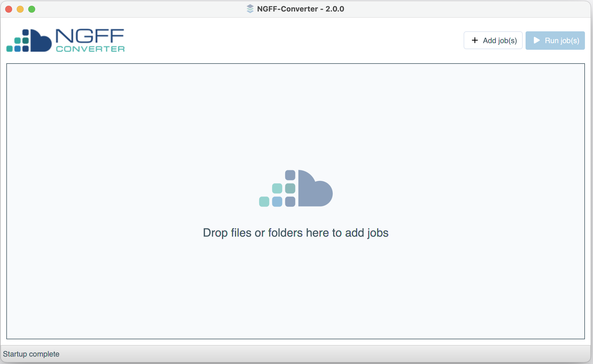

# NGFF-Converter

NGFF-Converter is an open source tool for converting bioimage formats to the [OME-TIFF](https://ome-model.readthedocs.io/en/stable/ome-tiff/) and [OME-NGFF](https://ngff.openmicroscopy.org/) specifications.

Formats [supported by the bio-formats library](https://bio-formats.readthedocs.io/en/stable/supported-formats.html) should be able to be converted by this tool. 
Internally NGFF-Converter uses the [bioformats2raw](https://github.com/glencoesoftware/bioformats2raw) and [raw2ometiff](https://github.com/glencoesoftware/raw2ometiff) packages for conversion.
With default settings, the resulting files should automatically have resolution pyramids generated if needed.

## Prebuilt Binaries

NGFF-Converter releases can be downloaded here:

## Usage

Running the tool will display a desktop GUI:

Files can be dragged and dropped onto this window to add them as conversion jobs. By default you'll see a window requesting
some basic settings when adding jobs.

When conversion jobs are added, you'll see a different interface with two lists. Each conversion **"Job"** is divided into 
multiple **"Tasks"** within each job. For example, converting .png to .ome.tiff requires two steps: The PNG is converted to
NGFF, then the resulting NGFF file is converted to TIFF. A third "Output" job offers settings for where to save the final result.

Clicking on the 'Configure' (cog) icon allows you to edit the settings for a specific job. Each task within a job has it's own configuration options.

For example, configuring the "Output" task will allow you to change the destination directory or filename.

From the main window, jobs can be started using the "Run" buttons. Only a single job will execute at a given time, any others 
will be queued. Job progress will be displayed next to the individual tasks. If all goes well, the job's status will change to
"completed".

If anything goes wrong a "Failed" status will display. Each job has it's own individual execution logs which may provide 
detail on what prevented the conversion. Hovering over the status label will also attempt to display any error messages.
Please note that it is possible to configure settings of individual tasks in ways which are incompatible with later workflow 
steps. The "help" icon next to each setting provides warnings about particularly disruptive settings.

If you need further help, please feel free to [raise an issue](https://github.com/glencoesoftware/NGFF-Converter/issues).

## License
NGFF-converter is distributed under the terms of the GPL license. Please see LICENSE.txt for further details.

## Build and run:

    ./gradlew clean build
    cd build/distributions
    unzip *.zip
    cd NGFF-Converter-0.1-SNAPSHOT
    ./bin/NGFF-Converter

### Dependencies
NGFF-Converter has the following requirements/dependencies:
- Java 16+
- JavaFX
- [bioformats2raw](https://github.com/glencoesoftware/bioformats2raw)
- [raw2ometiff](https://github.com/glencoesoftware/raw2ometiff)
- [blosc](https://github.com/Blosc/c-blosc)

See `build.gradle` for more precise versioning.

### Windows & MacOS
Download prebuilt, signed binaries for these platforms [here](https://www.glencoesoftware.com/products/ngff-converter/).

### Ubuntu
Running from source is possible via the following steps:

Install openjdk-17

    sudo apt install openjdk-17-jdk
    
Install the blosc dependency

    sudo apt-get install libblosc-dev

Clone and run the repo

## Project skeleton created using a combination of:

- https://github.com/openjfx/javafx-maven-archetypes/tree/master/javafx-archetype-fxml
- https://github.com/openjfx/samples/tree/master/CommandLine/Non-modular/Gradle
- https://openjfx.io/openjfx-docs/ (`Runtime Images > Non-Modular project`)

